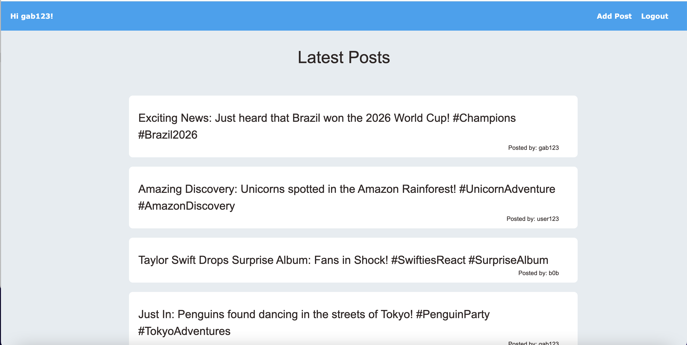

# Chitter: Twitter-like Application


Welcome to the Twitter-like application project, a work in progress developed as part of the Makers Bootcamp challenge. This project aims to create a simple social media platform where users can create accounts, log in, and post messages to a public board.


Project Status
This project is currently a work in progress, with ongoing development to enhance features and improve functionality. Expect updates and improvements.


Overview
Challenge Source: Makers Bootcamp
Project Type: Twitter-like Application
Features: Account creation, login (still to be improved), posting to a public board with username attribution.

## Tech Stack

For this app we will be using the following tech stack:
- Backend: Python, Flask App, PostgreSQL
- Frontend: HTML, CSS, JavaScript
- Testing: Test-Driven Development (TDD) approach

## Features

- Account Creation: Users can create accounts with valid passwords, emails, and usernames.
- Login Page: A login page is available (still to be improved).
- Public Board: Users can post messages to a public board, with their usernames attributed to the posts.

## Setup

```shell
# Install dependencies and set up the virtual environment
; pipenv install

# Activate the virtual environment
; pipenv shell

# Install the virtual browser we will use for testing
; playwright install
# If you have problems with the above, contact your coach

# Create a test and development database
; createdb chitter_challenge
; createdb chitter_challenge_test

# Open lib/database_connection.py and change the database names
; open lib/database_connection.py

# Run the tests (with extra logging)
; pytest -sv

# Run the app
; python app.py

# Now visit http://localhost:5000/ in your browser
```


## Testing

This project follows a Test-Driven Development (TDD) approach to ensure robust and reliable functionality. Extensive testing is being conducted to meet quality standards.

```
# Run the tests
; pipenv run pytest 
```

## Application

|   Description    |   Image    |
|:------------:|:----------------:|
|Landing Page| |
|Posts Page| |
|Create Account Page| |
|Create Post Page| |


## Issues and Feedback -->
If you encounter any issues or have feedback, please create a GitHub issue. This is still a working project, but I appreciate input. 


Thank you for exploring our Twitter-like application project! We look forward to any contributions and feedback.